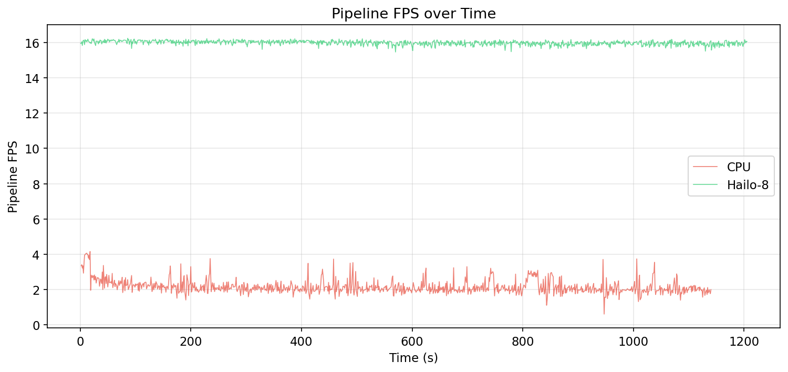
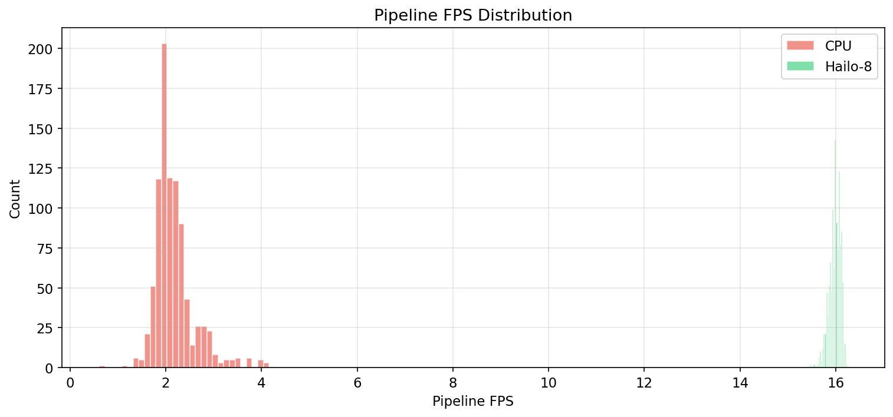
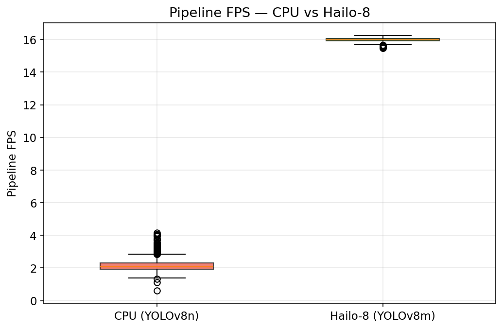
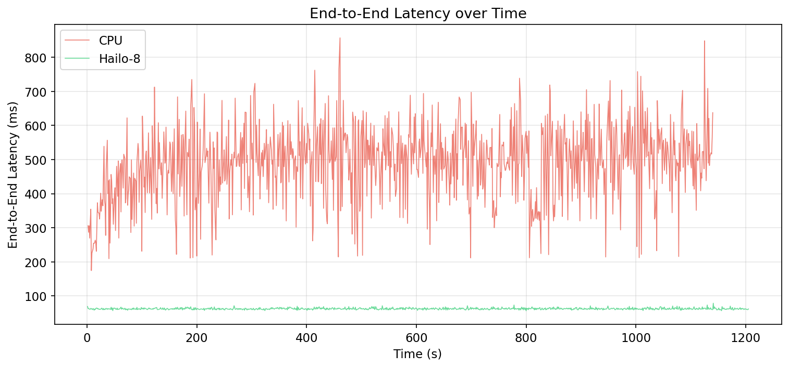
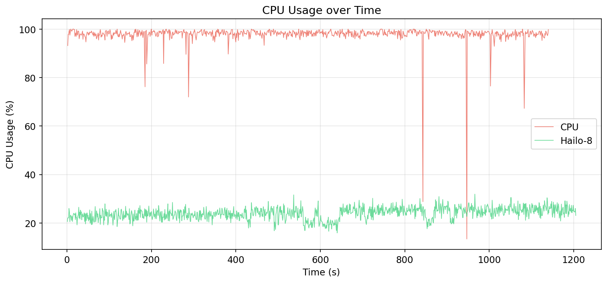
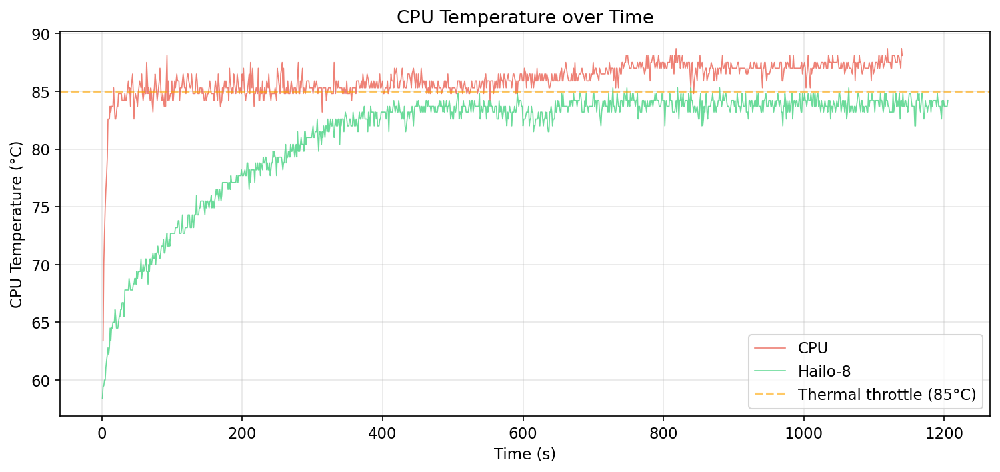
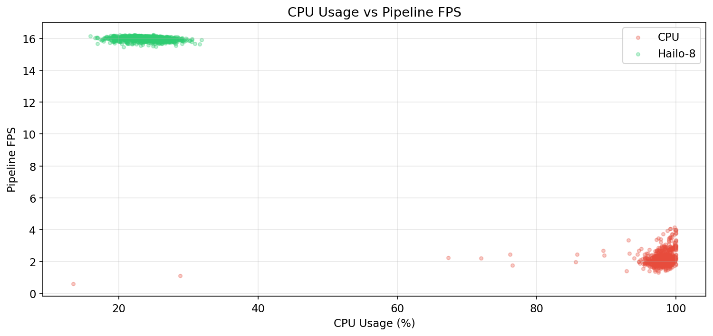
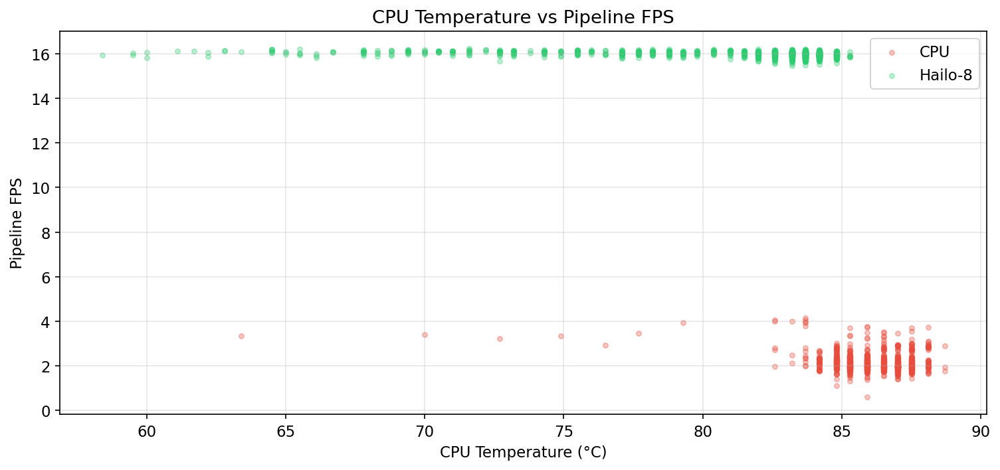

# MachineAI - Real-Time Person Detection on Raspberry Pi 5

Real-time person detection and system monitoring pipeline for **Raspberry Pi 5**, supporting dual inference backends: **CPU (ONNXRuntime)** and **Hailo-8 AI Accelerator (HailoRT)**.

> **TL;DR** — Hailo-8 delivers **7.3x higher FPS**, **76% less CPU usage**, and **8x lower latency** compared to CPU-only inference, while running a *larger* model (YOLOv8m vs YOLOv8n).

---

## Architecture

```
main.py              # Entry point — selects mode, wires pipeline
capture.py           # Threaded RTSP frame capture with auto-reconnect
detector_cpu.py      # YOLOv8 inference via ONNXRuntime (CPU)
detector_hailo.py    # YOLOv8 inference via HailoRT (Hailo-8)
detection.py         # Shared Detection data class
monitor.py           # System metrics: CPU, RAM, temperature, throttle
display.py           # ASCII dashboard + optional OpenCV overlay
logger.py            # CSV benchmark logging (1 row/second)
config.py            # All configuration in one place
benchmark_analysis.py # Post-run analysis: charts, tables, evaluation
```

---

## Benchmark Results

> **Test environment:** Raspberry Pi 5 (4 GB RAM, BCM2712, 4x Cortex-A76) | Debian aarch64 | RTSP IP camera | 640x640 input
> **Duration:** ~905 s (CPU) and ~1165 s (Hailo) of continuous inference. First sample excluded as warm-up.

### Summary Table

| Metric | CPU (YOLOv8n ONNX) | Hailo-8 (YOLOv8m HEF) | Delta |
|---|---|---|---|
| **FPS (mean)** | 2.17 | 15.98 | **7.3x** |
| **FPS (median)** | 2.08 | 15.99 | 7.7x |
| **FPS (min)** | 0.61 | 15.46 | — |
| **FPS (max)** | 4.16 | 16.24 | — |
| **Inference latency** | 477.6 ms | 57.2 ms | **8.4x faster** |
| **End-to-end latency** | 486.4 ms | 62.7 ms | **7.8x faster** |
| **CPU usage** | 97.9% | 24.0% | **-76%** |
| **Temperature (mean)** | 86.0 °C | 81.2 °C | -4.8 °C |
| **Temperature (max)** | 88.7 °C | 85.3 °C | -3.4 °C |
| **Thermal throttle ratio** | 100% | 77.3% | — |

### Charts

#### Throughput

| FPS over Time | FPS Distribution | FPS Box Plot |
|---|---|---|
|  |  |  |

#### Latency

| End-to-End Latency | Inference Latency |
|---|---|
|  |  |

#### System Resources

| CPU Usage | CPU Temperature |
|---|---|
|  |  |

#### Correlation Analysis

| CPU Usage vs FPS | Temperature vs FPS |
|---|---|
|  |  |

### Key Findings

- **7.3x throughput gain** — Hailo-8 achieved **16.0 FPS** (YOLOv8m) vs CPU's **2.2 FPS** (YOLOv8n), while running a larger, more accurate model.
- **76% CPU reduction** — Utilization dropped from **98%** (all cores saturated) to **24%**, freeing compute for application logic, networking, and multi-stream handling.
- **5 °C cooler** — Average SoC temperature fell from 86 °C to 81 °C. CPU mode was thermally throttled **100%** of the time.
- **8x lower latency** — Mean end-to-end frame latency dropped from **486 ms** to **63 ms**, enabling real-time alerting.
- **No RTSP bottleneck (yet)** — Frame decode + pre/post-processing overhead is only ~6 ms (9% of pipeline) in Hailo mode. This would become the next optimization target if inference were further accelerated.

---

## Requirements

- Raspberry Pi 5 (aarch64, Debian)
- Python 3.10+
- IP camera with RTSP stream (or USB camera)
- For Hailo mode: Hailo-8 M.2 module + HailoRT 4.23+

## Setup

```bash
python3 -m venv venv
source venv/bin/activate
pip install -r requirements.txt
```

### ONNX Model (CPU mode)

```bash
pip install ultralytics
yolo export model=yolov8n.pt format=onnx imgsz=640 opset=13
```

### Hailo Setup

Requires Hailo-8 module, HailoRT, and a compiled `.hef` file. The kernel must use 4K pages:

```bash
# /boot/firmware/config.txt
kernel=kernel8.img
```

## Usage

```bash
# CPU mode (default)
python main.py

# CPU mode with options
python main.py --imgsz 320 --conf 0.5 --skip 1

# Hailo mode
source ~/hailo-apps/setup_env.sh
python main.py --mode hailo --hef /path/to/yolov8m.hef

# With video display
python main.py --show

# USB camera
python main.py --source 0
```

## Configuration

Copy `.env.example` to `.env` and set your RTSP URL and mode:

```bash
cp .env.example .env
# Edit .env with your credentials
```

## CSV Logs & Analysis

Benchmark logs are written to `logs/` with timestamped filenames. To generate charts and analysis:

```bash
pip install numpy pandas matplotlib
python benchmark_analysis.py
```

Outputs are saved to `charts/`: 9 PNG charts, `summary_table.csv`, and `article_test_results.md`.

## License

MIT
